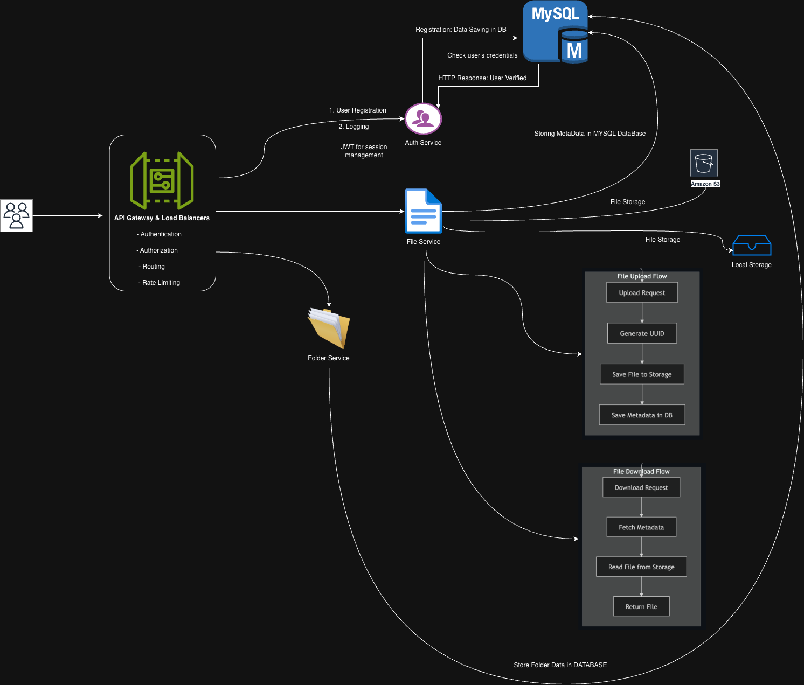
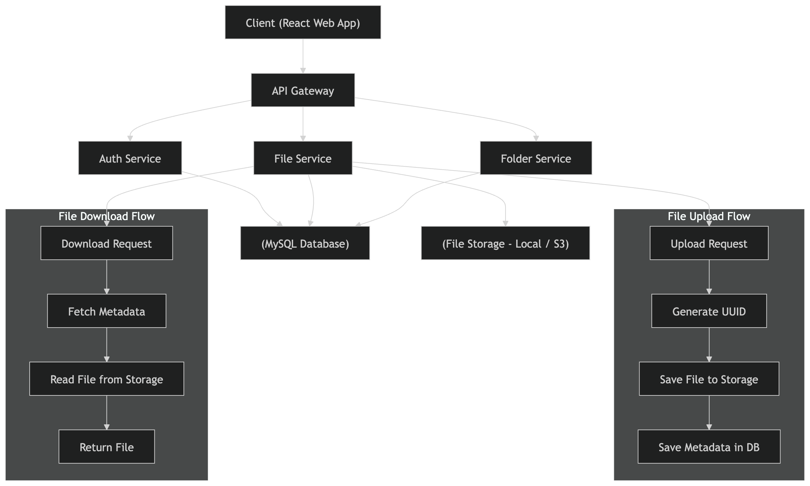
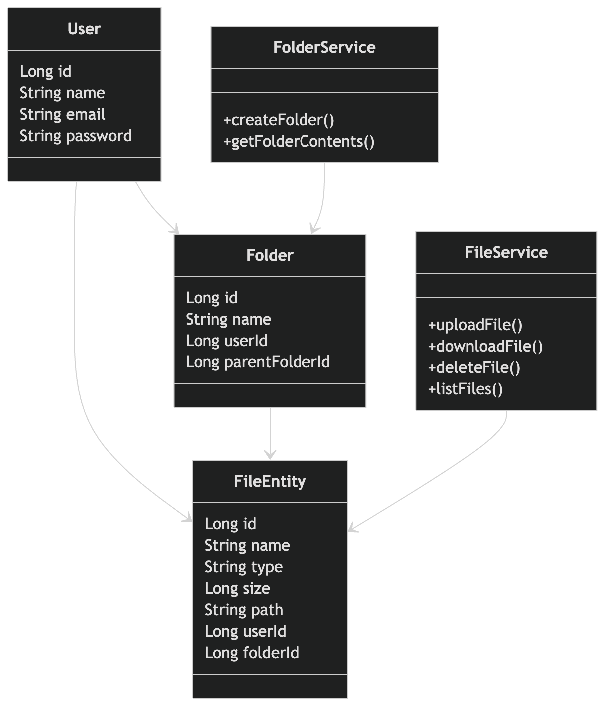
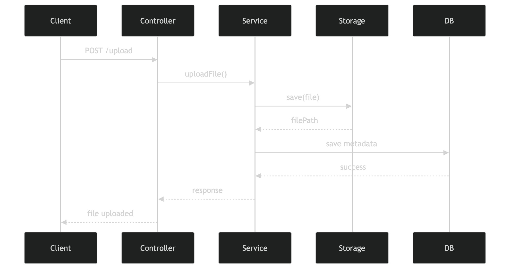

# Google Drive Clone (File Storage System)

A full-stack File Storage System built using Spring Boot (Java) and React (Vite). This application allows users to register, login, create nested folders, and upload/download files seamlessly, similar to Google Drive.

## Features

* **User Authentication**: Secure JWT-based registration and login.
* **File Management**: Upload files (stored securely on the local file system with UUIDs), download, and delete.
* **Folder Management**: Create folders and navigate through nested folder structures.
* **Premium UI**: Sleek, modern design with hover effects, micro-animations, and responsive grid layouts.

## Technology Stack

* **Frontend**: React, Vite, React Router DOM, Axios, Vanilla CSS
* **Backend**: Java, Spring Boot, Spring Security, JWT, Spring Data JPA
* **Database**: MySQL

---

## 🧠 System Design

## 🧠 High-Level Design (HLD)




## 🔧 Low-Level Design (LLD)



## 🔁 Sequence Diagram



## Project Setup Instructions

### 1. Database Setup (MySQL)

Before starting the backend, you need to set up the database.

1. Make sure you have MySQL installed and running on your local machine.
2. Open your MySQL client (e.g., MySQL Workbench or terminal).
3. Execute the SQL script located in the project to create the database and tables:

   ```bash
   mysql -u root -p < backend/database_schema.sql
   ```
4. Verify that the `filestorage` database was created successfully.

---

### 2. Backend Setup (Spring Boot)

1. Navigate to the backend directory:

   ```bash
   cd backend
   ```
2. Check the database configuration in `src/main/resources/application.properties`. Ensure that:

   ```properties
   spring.datasource.username=root
   spring.datasource.password=root
   ```
3. Run:

   ```bash
   ./mvnw spring-boot:run
   ```
4. Backend runs on `http://localhost:8080`.

---

### 3. Frontend Setup (React / Vite)

1. Navigate:

   ```bash
   cd frontend
   ```
2. Install dependencies:

   ```bash
   npm install
   ```
3. Run:

   ```bash
   npm run dev
   ```
4. Open `http://localhost:5173`.

---

## Usage Guide

1. Open `http://localhost:5173`
2. Sign up → Login
3. Create folders
4. Upload files
5. Navigate using breadcrumbs
6. Download/Delete files

---

## Architecture & Design

* **Local File Storage**: Files stored in `backend/uploads` with UUID names
* **Metadata Storage**: Stored in MySQL
* **Stateless Authentication**: JWT-based communication

---
